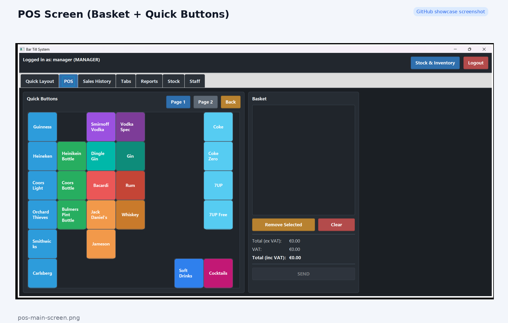
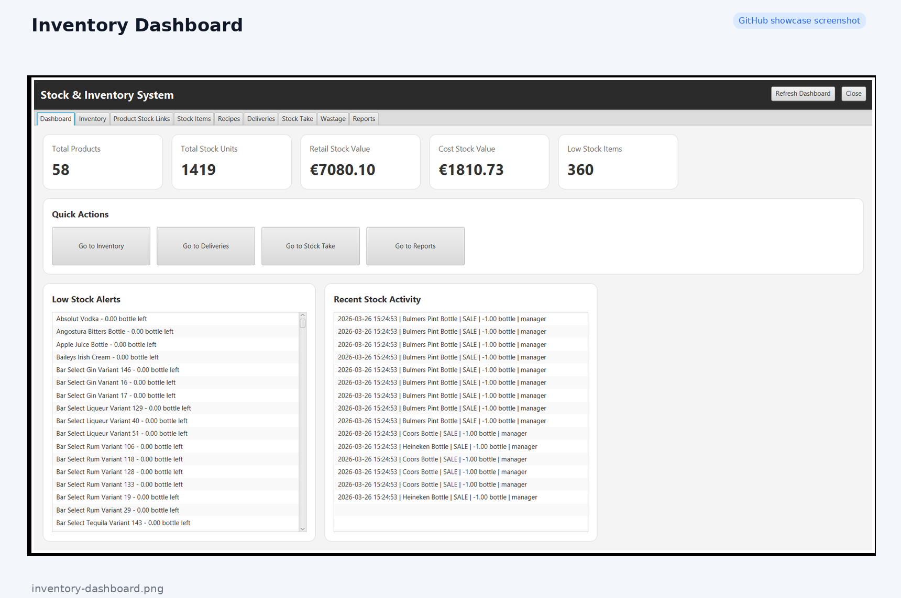
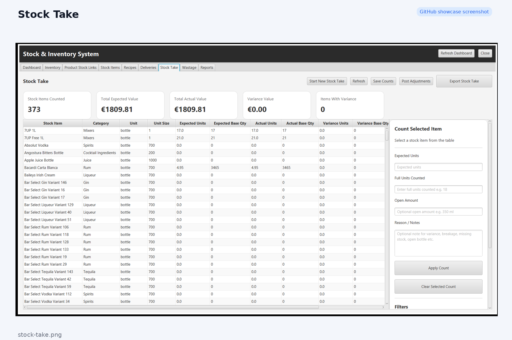
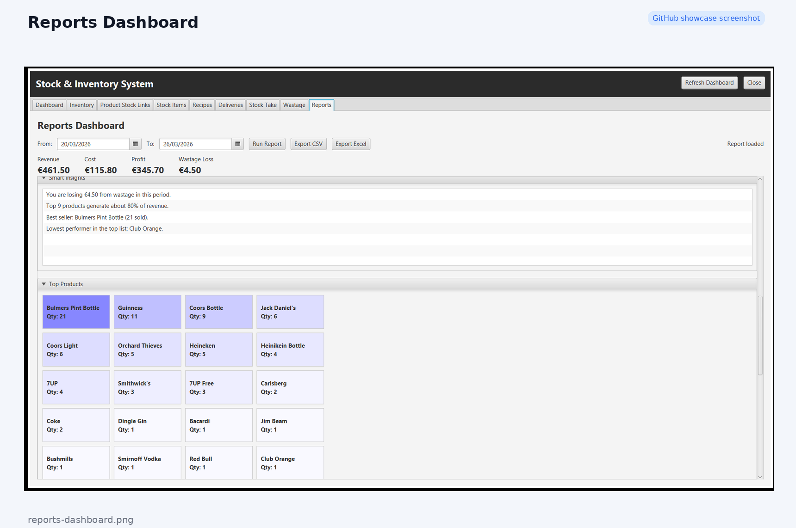
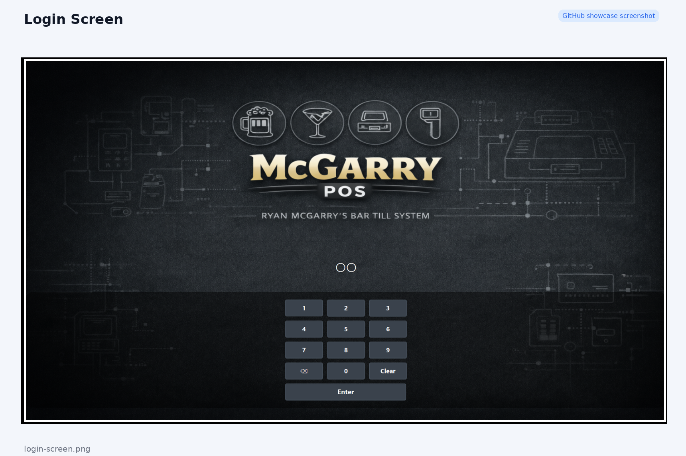

# 🍺 Bar Till System

   

> A full-featured JavaFX Point of Sale (POS) system for bars and hospitality environments.

---

## 🧾 POS Interface

---

## 🚀 Key Features

- 🧾 POS interface with quick-access buttons  
- 📦 Real-time inventory tracking  
- 🍺 Keg, bottle, and spirit stock handling  
- 🚚 Delivery and stock adjustment system  
- 📊 Profit, revenue, and wastage reports  
- 🧠 Smart stock alerts and insights  

---

## ⚙️ How It Works

- Products are linked to stock items (e.g. vodka bottle, keg)  
- Each sale deducts stock based on defined usage (e.g. 35ml per drink)  
- Stock levels are updated in real time  
- Reports calculate revenue, cost, profit, and wastage automatically  

---

## 📦 Inventory Dashboard

---

## 📊 Stock Take

---

## 📈 Reports

---

## 🔐 Login Screen

---

## 🛠️ Tech Stack

- Java  
- JavaFX  
- SQLite  
- Maven  

---

## 🛠️ Setup

1. Clone the repository  
2. Open in IntelliJ  
3. Run with Maven:

---

## 📦 Requirements

- Java 17+  
- Maven  
